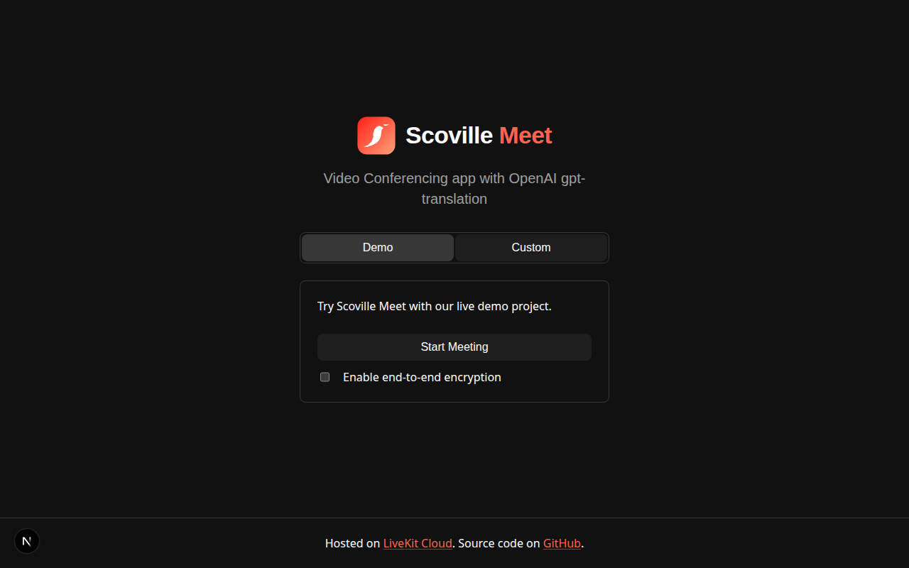

# Scoville Meet

Video conferencing built on [LiveKit Components](https://github.com/livekit/components-js) and Next.js, with per-listener live translation powered by OpenAI **gpt-realtime-translate**. Each participant joins a standard LiveKit room for audio and video; listeners can enable translation in the browser to hear remote speakers in their chosen language, with optional captions and volume controls — without republishing translated audio back into the room.

## Features

- LiveKit video rooms via the prebuilt `VideoConference` component (demo and custom connection modes)
- Per-listener translation sidecar: remote microphone tracks → OpenAI Realtime Translation (WebRTC)
- Translation overlay: enable/disable, output language, original & translated volume, source captions, near-field noise reduction
- Server-minted OpenAI client secrets (API key stays on the server)

## Tech stack

- [Next.js](https://nextjs.org/)
- [@livekit/components-react](https://github.com/livekit/components-js/)
- OpenAI Realtime Translation API (`gpt-realtime-translate`)

## Dev setup

1. Run `pnpm install` in the project root.
2. Copy `.env.example` to `.env.local`.
3. Set required variables:
   - `LIVEKIT_API_KEY`, `LIVEKIT_API_SECRET`, `LIVEKIT_URL` — your LiveKit project
   - `OPENAI_API_KEY` — for live translation (optional `OPENAI_TRANSLATION_MODEL`, defaults to `gpt-realtime-translate`)
4. Run `pnpm dev` and open [http://localhost:3000](http://localhost:3000).
5. **Demo** tab: starts a room using your LiveKit credentials via `/api/connection-details`.
6. **Custom** tab: connect with your own LiveKit URL and participant token.

### UI harness

Browser automation for regression checks lives in [`tools/ui-harness/`](tools/ui-harness/). See [`tools/ui-harness/AGENTS.md`](tools/ui-harness/AGENTS.md) for usage.

## Based on LiveKit Meet

This project extends the open source [LiveKit Meet](https://github.com/livekit/meet) app. LiveKit handles rooms, media, and devices; Scoville Meet adds the translation layer and branding.

  <a href="https://docs.livekit.io/">LiveKit Docs</a>
  •
  <a href="https://github.com/livekit/components-js">LiveKit Components</a>
  •
  <a href="https://developers.openai.com/cookbook/examples/voice_solutions/realtime_translation_guide">OpenAI live translation guide</a>

